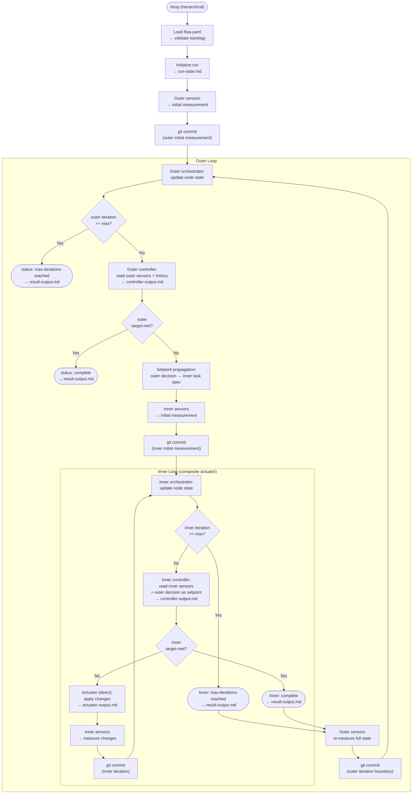
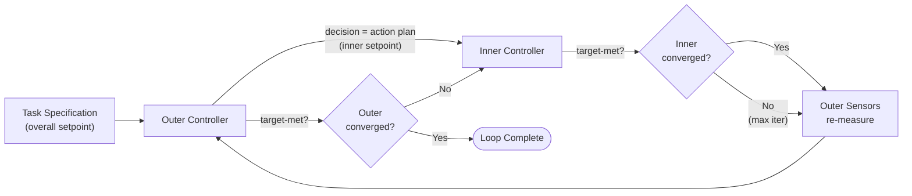

# AI Loops — Hierarchical Control Loops Design

## 1. Purpose & Scope

This document describes how the [Loop Architecture](loop-architecture.md) extends to support **hierarchical (cascaded) control loops**, where an inner loop acts as a composite actuator for an outer loop. It covers the conceptual model, topology configuration, artifact namespacing, orchestration flow, git strategy, setpoint propagation, state tracking, and resumability.

This is a **design document**, not an implementation spec. It follows the same implementation-agnostic stance as the architecture doc. For context on the concrete Claude Code plugin implementation, see [Detailed Design](loop-detailed-design.md). For a concrete use case analysis validating this design, see [Use Case: Hierarchical TDD Delivery](use-case-hierarchical-tdd.md).

**Motivations:**

1. **Multi-speed feedback**: A fast inner loop (e.g., typecheck, unit tests) for quick iteration, and a slow outer loop (e.g., full test suite, coverage analysis) for comprehensive validation.
2. **Task decomposition**: An outer loop that sequences through sub-tasks across its iterations, with an inner loop handling each sub-task through fine-grained iteration.

**Relationship to the existing architecture:**

The loop architecture already anticipates this in section 7.4 — any agent can be "a composite system (an agent framework orchestrating sub-agents)". Hierarchical loops formalize this: the inner loop is a composite actuator from the outer loop's perspective. All existing single-level behavior is preserved without modification.

---

## 2. Core Conceptual Model

### 2.1 One Primitive: The Loop

The system has **one primitive**: the **loop**. Everything else is configuration.

There is no `sequence` primitive and no `task` primitive:

- **`sequence` is controller intelligence, not a primitive.** In open-loop execution ("do A, then B, then C"), there is no feedback, no convergence judgment, no sensor-driven termination. The controller already has the intelligence to decompose work into phases and sequence sub-tasks across its iterations — that sequencing happens inside a feedback loop, which means it can self-correct. A wrapping loop can retry when a later phase reveals an earlier phase was insufficient. A standalone `sequence` cannot.

- **`task` is a degenerate loop.** A single-shot action is a `loop` with `max_iterations: 1` and no sensors. It takes input, produces output, and completes. Making it a separate primitive would mean separate execution semantics, a separate node contract, and more code paths in the orchestrator — for no behavioral gain.

One node type keeps the system honest and the orchestrator simple.

### 2.2 Plant Is Always Codebase

In control theory, the **plant** is the physical system being controlled. In AI Loops, the plant is always the **codebase** — at every level of nesting.

A child loop is not the plant that the parent controls. It is the *mechanism* by which the parent effects change on the codebase. The parent's sensors measure the codebase, not the child loop. The parent's `target-met` judgment is about codebase state, not child-loop state.

This holds at any depth: a grandparent's sensors still ultimately probe the same codebase as the innermost actuator modifies.

### 2.3 Nesting Is in the Actuator Strategy

What varies across levels is the **actuator strategy**:

- **Direct actuator**: The actuator modifies the codebase directly. This is the single-level case from the base architecture.
- **Composite actuator**: The actuator launches a child loop that eventually modifies the codebase. The child loop runs its own sensor-controller-actuator cycle to convergence (or max iterations), then control returns to the parent.

From the parent's perspective, the composite actuator is opaque — it takes the controller's decision as input and produces codebase changes as output. The fact that a complete inner feedback loop runs inside is an implementation detail of the actuator strategy.

### 2.4 Setpoint Propagation (Cascade Control)

In cascade control, the outer controller's output becomes the inner controller's **setpoint** (reference signal). This is the critical wiring that makes the hierarchy work:

1. The **outer controller** reads outer sensor observations and the task specification. It produces a decision with a scoped action plan (e.g., "implement the data model with validation").
2. This decision artifact becomes the **inner loop's task specification** — its setpoint.
3. The **inner controller** reads inner sensor observations and judges convergence against the outer controller's action plan, not against the original task specification.
4. Inner `target-met` means "the outer controller's current action plan has been satisfied."
5. Outer `target-met` means "the overall task target is satisfied."

This chains naturally to any depth: at each level, the parent's decision becomes the child's setpoint.

### 2.5 Sequencing Emerges from Controller Intelligence

The controller sequences phases across its iterations without needing a dedicated primitive. Example — implementing a feature with multiple sub-tasks:

1. **Outer iteration 1**: Outer controller reads the full task and broad sensors (integration tests, coverage). It decomposes the work and produces an action plan: "implement the data model with validation." Inner loop iterates on that sub-task with fast sensors until done.
2. **Outer iteration 2**: Outer sensors re-measure. Outer controller sees the model is done but the API endpoint is missing. Issues next action plan: "implement the REST endpoint for the new model." Inner loop iterates.
3. **Outer iteration 3**: Outer sensors show model + endpoint work. Controller issues: "add integration tests for the endpoint." Inner loop iterates.
4. **Outer iteration 4**: All outer sensor targets met. `target-met: true`. Loop complete.

Each outer iteration advances one sub-task, with feedback at every step. If iteration 3 reveals that the endpoint broke the model, the outer controller can course-correct — something a `sequence` primitive could never do.

### 2.6 Summary

| Principle | Statement |
|-----------|-----------|
| **One primitive** | Everything is a `loop`. Single-shot work = `max_iterations: 1`. Sequencing = controller intelligence. |
| **Plant = codebase** | Always. At every level. The thing being controlled is the code. |
| **Nesting = actuator strategy** | `direct` (actuator modifies code) or `composite` (actuator launches a child loop). |
| **Setpoint propagation** | Parent decision → child task specification. First-class, explicit. |
| **Unbounded depth** | The architecture is naturally recursive. No artificial depth cap. |

---

## 3. Flow Configuration

### 3.1 Configuration File

The loop hierarchy is defined in `.ai-loop/flow.yaml`. This file is the **single source of truth** for the topology and node wiring. Every loop run requires a `flow.yaml` — the orchestrator will not start without one.

### 3.2 Schema

```yaml
version: 1

defaults:
  termination:
    on_error: fail-fast

flow:
  id: delivery-loop
  type: loop
  controller: .claude/agents/loop-controller-outer.md
  actuator:
    strategy: composite
    child:
      id: implement-feature
      type: loop
      controller: .claude/agents/loop-controller-inner.md
      actuator:
        strategy: direct
        agent: .claude/agents/loop-actuator.md
      sensors:
        - .claude/agents/loop-sensor-typecheck.md
        - .claude/agents/loop-sensor-unit-tests.md
      termination:
        max_iterations: 12
  sensors:
    - .claude/agents/loop-sensor-full-tests.md
    - .claude/agents/loop-sensor-coverage.md
  termination:
    max_iterations: 5
```

### 3.3 Design Decisions

**Direct agent references.** Nodes reference agent files directly (e.g., `.claude/agents/loop-controller-outer.md`) rather than through a top-level `agents:` indirection map. The indirection would enable agent reuse across nodes, but in practice, different loops at different levels need different controllers. Direct references reduce config complexity with no V1 cost. An `agents:` map can be added as a future optimization if reuse patterns emerge.

**Inline child nodes.** Child loops are declared inline within the parent's `actuator.child` field, making the parent-child relationship explicit in the config structure. The `nodes:` section from the previous draft (where child nodes were defined separately and referenced by ID) is dropped — inline declaration is clearer for tree-shaped topologies.

**Actuator as strategy object.** The `actuator` field is either `{ strategy: direct, agent: <path> }` for leaf loops or `{ strategy: composite, child: <loop-config> }` for parent loops. This makes the nesting model explicit: the actuator strategy is what varies, not the plant.

### 3.4 Single-Shot Loops in Config

A single-shot step (e.g., "generate a plan artifact", "run a packaging step") is configured as a loop with `max_iterations: 1` and no sensors:

```yaml
id: generate-plan
type: loop
controller: .claude/agents/loop-planner.md
actuator:
  strategy: direct
  agent: .claude/agents/loop-actuator.md
sensors: []
termination:
  max_iterations: 1
```

The controller produces a decision, the actuator executes it, and the loop terminates after one iteration. No special node type needed.

### 3.5 Single-Level Flows

A single-level loop (the simplest case) is configured as a `flow.yaml` with one `loop` node and a `direct` actuator. This is the equivalent of the former flat mode, now expressed as a standard flow configuration.

---

## 4. Artifact Namespacing

### 4.1 Run-Based Layout

The flat `.ai-loop/*.md` layout does not scale to nested execution. Hierarchical mode uses **run-based namespacing** that encodes the execution tree:

```
.ai-loop/
  flow.yaml
  runs/
    {run-id}/
      run-state.md
      nodes/
        delivery-loop/
          orchestrator-output.md
          controller-output.md
          sensor-full-tests-output.md
          sensor-coverage-output.md
          result-output.md
        delivery-loop/implement-feature/
          orchestrator-output.md
          controller-output.md
          actuator-output.md
          sensor-typecheck-output.md
          sensor-unit-tests-output.md
          result-output.md
```

**Key properties:**

- **`run-id`** identifies one root execution (e.g., `run_20260225_001`). Multiple runs don't collide.
- **Node path** encodes position in the execution tree using `/`-separated IDs. Supports N levels naturally.
- **`result-output.md`** exists for every node — the universal output contract.

### 4.2 The `result-output.md` Contract

Every loop node produces a `result-output.md` upon termination. This is the standardized interface that enables composability — a parent consumes its child's result without knowing the child's internal structure.

**Frontmatter fields:**

```yaml
---
status: complete              # complete | max-iterations-reached | error
target-met: true              # boolean
termination-reason: target-met
run-id: run_20260225_001
node-id: implement-feature
node-path: delivery-loop/implement-feature
parent-node-path: delivery-loop
iterations-executed: 4
---
```

**Body sections:**

- **Summary** — concise description of what the loop achieved
- **Metrics delta** — key measurements before/after (relative to the loop's baseline)
- **Key observations for parent controller** — information the parent needs for its next decision
- **What was attempted / last strategy** — useful when the loop did not converge
- **Failure details** — if status is `error`

**Minimum parent-consumable fields:** `status`, `target-met`, and a concise summary. The parent controller reads this to decide its next action.

---

## 5. Execution Semantics

### 5.1 Recursive Orchestration

The root orchestrator remains the only global scheduler. It executes the flow recursively:

1. Load `.ai-loop/flow.yaml`
2. Validate topology and agent references
3. Initialize `run-id` and root run state
4. Execute the root `flow` node recursively
5. Persist root result and final status

Recursive behavior for a `loop` node:

1. Orchestrator initializes node state (`orchestrator-output.md`)
2. Run sensors (initial measurement)
3. Commit (initial measurement boundary)
4. Enter iteration cycle:
   a. Orchestrator updates node state
   b. Check iteration count against `max_iterations` → if reached, finalize
   c. Run controller → produces decision
   d. If `target-met: true` → finalize
   e. Execute actuator:
      - If `strategy: direct` → spawn actuator agent → modifies code
      - If `strategy: composite` → **recurse into child loop** (the child loop's entire execution replaces a single actuator step)
   f. Run sensors (measure post-actuation state)
   g. Commit (iteration boundary)
   h. Next iteration
5. Produce `result-output.md`

### 5.2 Setpoint Propagation in Execution

When the actuator strategy is `composite`, the orchestrator wires setpoint propagation:

1. The parent controller produces its decision artifact (action plan for this iteration).
2. The orchestrator passes this decision as the **task specification input** to the child loop.
3. The child loop's controller reads this as its setpoint — it judges convergence against the parent's action plan, not against the original top-level task.
4. When the child loop terminates, the orchestrator reads the child's `result-output.md`.
5. Control returns to the parent: parent sensors re-measure the codebase.

This is the cascade control wiring. The parent's "what to do" becomes the child's "what to achieve."

### 5.3 Sensor Cadence Across Levels

No event-bus abstraction is needed. Cadence is implied by loop structure:

- **Inner sensors** run at inner-loop iteration cadence (fast feedback).
- **Outer sensors** run at outer-loop iteration cadence (after the inner loop completes).
- At each level, sensors run after the actuator completes — whether the actuator is direct or composite.

This directly captures "fast inner tests, slow outer full-suite" without generic trigger semantics.

### 5.4 Flow Diagram



---

## 6. Git Strategy

### 6.1 Trunk-Based, Linear History

All levels commit on a **single branch** with linear history. No sub-branches, no merge commits for child loops.

**Rationale — continuous delivery principles applied to multi-agent work:**

- **Branch-and-merge isolates, then integrates late** — exactly the anti-pattern CD rejects. Merge conflicts are the symptom of deferred integration.
- **Trunk-based CD integrates continuously** — agents commit to a shared trunk, are aware of each other's work, and resolve conflicts early and incrementally.

With linear history on a single branch:
- No branch cascade complexity at any depth
- No merge conflict failure mode
- Resume is simpler (no branch state to reconstruct)
- `git log --oneline` shows the complete timeline without `--graph`

### 6.2 Structured Commit Messages

Commit messages encode the node path and level, making the hierarchy visible in `git log`:

```
ai-loop[delivery-loop]: iteration 1 — decompose into sub-tasks
ai-loop[delivery-loop > implement-feature]: iteration 1.1 — initial measurement
ai-loop[delivery-loop > implement-feature]: iteration 1.2 — add data model
ai-loop[delivery-loop > implement-feature]: iteration 1.3 — fix validation
ai-loop[delivery-loop > implement-feature]: iteration 1.3 — inner converged
ai-loop[delivery-loop]: iteration 1 — inner converged, re-measuring
ai-loop[delivery-loop]: iteration 2 — API endpoint needed
ai-loop[delivery-loop > implement-feature]: iteration 2.1 — initial measurement
ai-loop[delivery-loop > implement-feature]: iteration 2.2 — add REST endpoint
ai-loop[delivery-loop]: iteration 2 — inner converged, re-measuring
ai-loop[delivery-loop]: iteration 3 — all targets met, complete
```

**Structured metadata block** in the commit body:

```
ai-loop[delivery-loop > implement-feature]: iteration 1.2 — add data model

[node-path] delivery-loop/implement-feature
[level] 1
[iteration] 1.2
[status] running
[target-met] false
[sensors] typecheck: pass, unit-tests: fail
[action] added User model with validation rules
```

**Notation:** `N.M` = outer iteration N, inner iteration M. For deeper nesting: `N.M.P` etc.

### 6.3 Timeline Reconstruction

The full iteration history is reconstructable from git:

- `git log --grep="\[node-path\] delivery-loop$"` — outer iteration boundaries only
- `git log --grep="\[node-path\] delivery-loop/implement-feature"` — inner iteration detail
- `git log --grep="\[level\] 0"` — all top-level events
- `git log --oneline` — complete timeline

### 6.4 Future: Parallel Agents

For future parallel agent work, the design direction is **CD-inspired integration** rather than branch-and-merge isolation:

- Agents work on the same trunk (or the same loop branch)
- Agents are aware that parallel work is happening (context in their prompts / artifacts)
- A coordination mechanism (could be a sensor, could be a dedicated "integration" agent) detects divergence early and facilitates resolution
- Integration happens continuously, not as a deferred merge event

This is an open design area worth a dedicated exploration and is out of scope for this document.

---

## 7. Convergence Propagation

### 7.1 Two Independent Judgments Per Level

Inner and outer convergence are independent:

- **Inner `target-met`**: "The outer controller's current action plan has been fulfilled." Judged by the inner controller against the outer decision artifact (its setpoint).
- **Outer `target-met`**: "The overall task target is satisfied." Judged by the outer controller against the task specification.

Inner loop convergence does **not** imply outer loop convergence. The outer sensors may reveal issues invisible to the inner sensors (e.g., inner sensors check typecheck + unit tests, outer sensors run integration tests that fail).

### 7.2 Inner Loop Exhaustion

If the inner loop hits max iterations without converging, control returns to the outer loop anyway. The outer controller receives the inner loop's `result-output.md` (with `status: max-iterations-reached`) and can:

- Adjust its strategy based on partial progress
- Issue a revised action plan for the next inner loop cycle
- Decompose differently

The inner loop's partial state is fully visible via git history and the inner node's artifacts.

### 7.3 Convergence Flow Diagram



This generalizes to N levels: each level's controller produces a decision that becomes the next level's setpoint. Convergence propagates upward — inner convergence triggers re-measurement at the next outer level.

---

## 8. State & Resumability

### 8.1 Run State

The root run state is maintained in `.ai-loop/runs/{run-id}/run-state.md`:

```yaml
---
run-id: run_20260225_001
status: running
active-node-path: delivery-loop/implement-feature
execution-stack:
  - delivery-loop
  - delivery-loop/implement-feature
branch: ai-loop/implement-auth
base-branch: main
---
```

The execution stack records which nodes are currently active (from outermost to innermost). This is a list of node paths — the same algorithm works at depth 2 or 5.

### 8.2 Node State

Each node maintains its own `orchestrator-output.md` at its artifact path:

```yaml
---
iteration: 3
status: running
max-iterations: 12
node-path: delivery-loop/implement-feature
parent-node-path: delivery-loop
---

# Task (setpoint)

Implement the data model with validation rules for the User entity.
Fields: name (string, required), email (string, valid format), role (enum: admin, user).
```

Note how the task section contains the parent controller's action plan — this is the setpoint propagation made visible in the artifacts.

### 8.3 Resume Logic

To resume an interrupted run:

1. Read `.ai-loop/runs/{run-id}/run-state.md` — determine run status and active node path.
2. Read the execution stack — identify the innermost active node.
3. Read that node's `orchestrator-output.md` — determine iteration position.
4. Check which artifacts exist at that node path to determine the exact position in the cycle (e.g., sensors ran but controller hasn't — resume from controller step).
5. Resume from the determined position.

**Resume rules:**

- If interrupted during a child loop → resume child first
- If child completed but parent sensors haven't run → run parent sensors
- Never skip parent re-measurement after a child loop completes

### 8.4 No Depth Constraint

With the refined design decisions (linear git, node-path namespacing, stack-based resume), none of the original concerns about depth are architecture-dependent:

| Original concern | Resolution |
|-------------------|------------|
| Branch cascade complexity | Gone — trunk-based, single branch |
| Deep artifact paths | `runs/{run-id}/nodes/{node-path}/` handles any depth |
| Resume difficulty | Execution stack is a list of node paths; same algorithm at any depth |
| Setpoint propagation | Chains naturally — each level passes decision to child |

The remaining concern is **cognitive load for humans** — but that's a UX/tooling problem (`/loop-status` rendering a clear tree), not an architectural constraint.

---

## 9. Use Case Walkthroughs

### 9.1 Multi-Speed Sensors

**Scenario**: A TypeScript project where typechecking takes 2 seconds but the full test suite takes 2 minutes.

**Config:**
```yaml
flow:
  id: delivery-loop
  type: loop
  controller: .claude/agents/loop-controller-outer.md
  actuator:
    strategy: composite
    child:
      id: implement
      type: loop
      controller: .claude/agents/loop-controller-inner.md
      actuator:
        strategy: direct
        agent: .claude/agents/loop-actuator.md
      sensors:
        - .claude/agents/loop-sensor-typecheck.md
        - .claude/agents/loop-sensor-unit-tests.md
      termination:
        max_iterations: 10
  sensors:
    - .claude/agents/loop-sensor-full-tests.md
    - .claude/agents/loop-sensor-coverage.md
  termination:
    max_iterations: 5
```

**Flow**: The outer loop runs the expensive full test suite and coverage analysis. When targets aren't met, the inner loop iterates quickly using only typecheck and fast unit tests. Once the inner loop converges, the outer loop re-runs the full suite to check for integration issues and coverage regressions.

### 9.2 Task Decomposition

**Scenario**: Implementing a feature with multiple sub-tasks (add model, add API endpoint, add tests).

**Config**: Same as 9.1 — the topology doesn't change. The outer controller's intelligence handles the sequencing.

**Flow**:

1. Outer controller reads the full task and broad sensors (integration tests, coverage). Produces action plan: "implement the User data model with validation."
2. Inner loop iterates on the data model with fast sensors until converged.
3. Outer sensors re-measure. Controller sees model is done but API endpoint is missing. Produces next action plan: "implement REST endpoint for User CRUD operations."
4. Inner loop iterates on the endpoint.
5. Outer sensors re-measure. Controller sees model + endpoint work but coverage is below threshold. Produces: "add integration tests for User endpoint."
6. Inner loop iterates on tests.
7. Outer sensors re-measure. All targets met. Complete.

The sequencing emerged from the outer controller's intelligence, with feedback at every step.

### 9.3 Three Levels Deep

**Scenario**: A delivery loop that decomposes features, where each feature has its own inner implementation loop.

**Config:**
```yaml
flow:
  id: delivery
  type: loop
  controller: .claude/agents/loop-controller-delivery.md
  actuator:
    strategy: composite
    child:
      id: feature
      type: loop
      controller: .claude/agents/loop-controller-feature.md
      actuator:
        strategy: composite
        child:
          id: implement
          type: loop
          controller: .claude/agents/loop-controller-inner.md
          actuator:
            strategy: direct
            agent: .claude/agents/loop-actuator.md
          sensors:
            - .claude/agents/loop-sensor-typecheck.md
          termination:
            max_iterations: 10
      sensors:
        - .claude/agents/loop-sensor-unit-tests.md
      termination:
        max_iterations: 5
  sensors:
    - .claude/agents/loop-sensor-integration-tests.md
    - .claude/agents/loop-sensor-coverage.md
  termination:
    max_iterations: 3
```

**Setpoint chain:**
- Delivery controller → "implement user authentication feature" → feature loop setpoint
- Feature controller → "add JWT token validation middleware" → implement loop setpoint
- Inner controller → judges convergence against "add JWT token validation middleware"

**Commit log:**
```
ai-loop[delivery > feature > implement]: iteration 1.1.1 — initial measurement
ai-loop[delivery > feature > implement]: iteration 1.1.2 — add JWT middleware
ai-loop[delivery > feature > implement]: iteration 1.1.3 — fix import
ai-loop[delivery > feature]: iteration 1.1 — inner converged, re-measuring
ai-loop[delivery > feature > implement]: iteration 1.2.1 — add token refresh
ai-loop[delivery > feature]: iteration 1.2 — inner converged, re-measuring
ai-loop[delivery]: iteration 1 — feature converged, re-measuring
```

The architecture handles 3 levels with no special casing — same recursive execution, same artifact namespacing, same setpoint propagation.

### 9.4 Further Analysis

For a deeper validation of the hierarchical model against a real-world scenario — including design trade-offs, gap analysis, and an example YAML configuration — see [Use Case: Hierarchical TDD Delivery](use-case-hierarchical-tdd.md). That analysis maps a multi-scenario TDD delivery workflow onto the 2-level cascade control model and confirms the architecture handles it without modification.

---

## 10. Plugin Impact

This section is intentionally implementation-oriented and guides changes to the current Claude Code plugin.

### 10.1 `/loop`

**Behavior:**

- Requires `.ai-loop/flow.yaml` — will not start without it.
- Executes recursive orchestration based on the flow topology.

**Responsibilities:**
- Parse and validate `flow.yaml`
- Recursive node execution
- Setpoint propagation (passing parent decision as child task spec)
- Artifact namespacing by `run-id`/`node-path`
- Structured commit messages with node-path metadata
- Stack-based resume

### 10.2 `/loop-setup`

**Behavior:**

- Generate or refresh `.ai-loop/flow.yaml` based on project analysis and user interaction
- Generate agent files referenced by the flow (sensors, controllers, actuators)
- Support assigning different sensors/controllers per loop level
- Keep project-local agent files as the executable concretions of the config

This preserves the current plugin philosophy: the plugin scaffolds and refreshes, the project owns the generated agents/config.

### 10.3 `/loop-status`

**Behavior:**

- Read root `run-state.md`: show run ID, status, active node path, execution stack
- Render the execution tree with status per node
- Show latest result per active/most recent node
- Summarize last sensor/controller outputs for the selected node

---

## 11. Migration from Flat Mode

Flat mode (no `flow.yaml`) is no longer supported. To migrate an existing flat setup:

1. Run `/loop-setup` — it will detect existing sensor agents and guide the user through generating a `flow.yaml` configuration.
2. A single-level flat loop maps to a 1-level flow with one `loop` node and a `direct` actuator strategy.
3. The new run-based artifact layout (`runs/{run-id}/nodes/{node-path}/`) replaces the flat `.ai-loop/*.md` layout.

---

## 12. Test Scenarios

### 12.1 Functional Scenarios

1. **Single-level flow** — 1-node `flow.yaml` with direct actuator → simplest hierarchical case
2. **Minimal nested loop** — Parent loop launches child loop → child converges → parent sensors run after child completion → parent re-evaluates
3. **Fast/slow sensor split** — Child loop runs fast tests each iteration; parent loop runs full suite only at parent cadence
4. **Child max iterations** — Child ends with `max-iterations-reached` → parent receives result and adjusts strategy
5. **Resume during child loop** — Interruption mid-child → resume continues child, then returns to parent
6. **Setpoint propagation** — Parent controller's action plan appears as child's task specification; inner `target-met` judges against that plan, not the top-level task
7. **Multi-phase via controller sequencing** — Outer controller naturally sequences sub-tasks across iterations without a `sequence` primitive
8. **Three-level nesting** — Grandparent → parent → child, with setpoint chaining and correct artifact namespacing at all levels

### 12.2 Failure Scenarios

1. **Invalid flow config** — Missing agent reference, invalid node structure → validation fails before execution
2. **Child loop error** — Child loop encounters an unrecoverable error → `result-output.md` with `status: error` → parent decides next action or run stops (per `on_error` policy)
3. **Corrupt child result** — Parent cannot parse `result-output.md` → run stops with explicit error

---

## 13. Open Questions

1. **Flow config format**: YAML file (as shown) vs. YAML frontmatter in a markdown file? The markdown approach is consistent with other `.ai-loop/` artifacts but `flow.yaml` is purely structural — no prose content. Current proposal: standalone YAML.

2. **Inner controller generation**: Should `/loop-setup` generate inner controllers from a separate template that includes the "read parent decision as setpoint" instruction, or should it be a variant of the existing controller template with a flag?

3. **Topology changes mid-run**: What happens if `flow.yaml` is modified while a run is active? Proposed: not supported in V1. The topology is read at run start and fixed for the duration.

4. **Result-output.md authorship**: Should the orchestrator produce `result-output.md` (it has all the data) or should the controller produce it as part of its final target-met decision? Proposed: orchestrator produces it, since it owns lifecycle and has access to all artifacts.

5. **Single-shot loop UX**: Is `max_iterations: 1` with `sensors: []` clear enough for single-shot steps, or should the config support a shorthand (e.g., `type: loop` with an `actuator-only: true` flag)?
