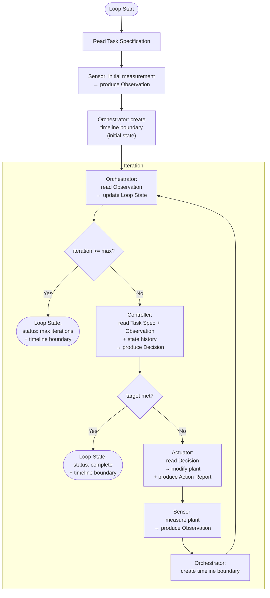
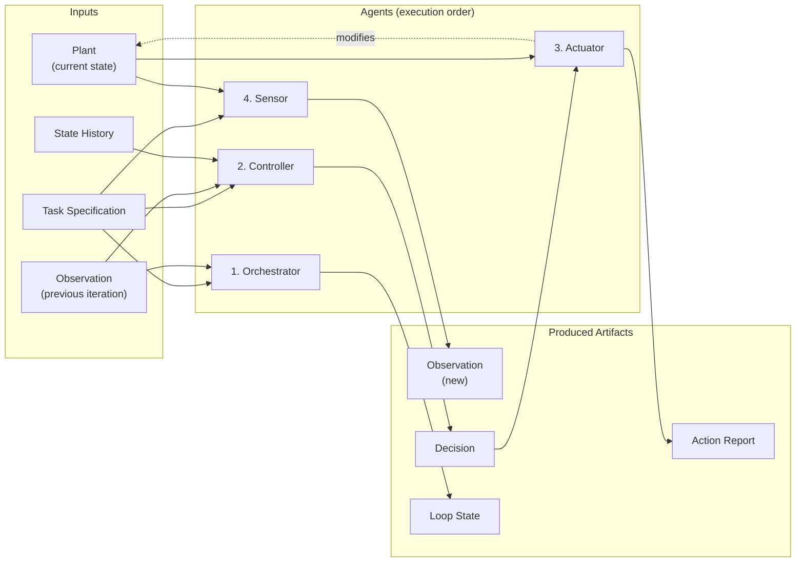

# AI Loops — Loop Architecture

## 1. Purpose & Scope

This document describes the **abstract architecture** of the AI Loop: the agents, artifacts, data flow, iteration lifecycle, and guarantees that define how a closed-loop control system drives an agentic coding session toward a target state.

It is deliberately **implementation-agnostic**. It does not prescribe how artifacts are stored, how agents are executed, or how state history is managed. Whether artifacts are persisted locally, exchanged via API calls between services, stored as records in a database, or passed verbally between humans — the architecture remains the same.

**Related documents:**

- [Conceptual Framework](concept-control-loop-framework.md) — the control theory foundations: why feedback loops work, what P/PI/PID/Adaptive strategies mean, stability, convergence, and advanced parallels.
- [Detailed Design](loop-detailed-design.md) — a concrete implementation of this architecture as a Claude Code plugin, with skills, custom agents, file-based artifacts, and git as the timeline.
- [Hierarchical Loops](hierarchical-loops-design.md) — extending the architecture to support hierarchical control loops where an inner loop acts as a composite actuator for an outer loop.
- [Use Case: Hierarchical TDD Delivery](use-case-hierarchical-tdd.md) — concrete validation of the hierarchical model against a multi-scenario TDD delivery workflow.

---

## 2. Agents & Responsibilities

The loop comprises **four active agents** and one **static input**. Each agent has a single, well-defined responsibility. Agents communicate exclusively through artifacts — they share no mutable state and have no direct knowledge of each other's internals.

### 2.1 Task Specification (Input)

The task specification is the **setpoint** of the loop. It defines what the loop is trying to achieve at any given iteration.

| | |
|---|---|
| **Purpose** | Define what the loop must achieve and how to measure progress |
| **Content** | A natural-language task description, the set of sensors to run (with their commands and target conditions), and termination parameters (e.g., maximum iterations) |
| **Consumers** | Sensor, Controller, Orchestrator |
| **Mutability** | May be constant across all iterations or updated between iterations |

The task specification is not an agent — it does not execute. It is the reference input that all agents consult.

A constant task specification (same setpoint throughout the loop) is the simplest case. But the architecture does not require it — the input may change between iterations (new requirements, revised targets, adjusted sensor definitions). From the loop's perspective, each iteration simply reads the current task specification; whether it differs from the previous iteration's is irrelevant to the iteration mechanics.

### 2.2 Sensor

> **Observe the current state. Change nothing.**

| | |
|---|---|
| **Consumes** | Task Specification (sensor command definitions), the current state of the plant (codebase) |
| **Produces** | Observation artifact |
| **Key properties** | Read-only, idempotent, stateless |
| **Must NOT** | Modify the plant, make judgments about whether the target is met |

The sensor probes the plant and produces an observation containing the **useful signal** extracted from the underlying measurement process. This is a key distinction: the sensor is not necessarily a dumb pipe that forwards raw output verbatim. When the measurement process produces verbose logs, noisy data, or large volumes of output, the sensor may extract, summarize, or structure the relevant information — compressing thousands of lines of output into the metrics and details that matter for this particular measurement.

What the sensor must *not* do is judge whether the results are good or bad relative to the target — that responsibility belongs to the controller. The sensor answers "what is the current state?" not "are we on track?"

Running the sensor twice on the same plant state must produce the same observation (barring non-deterministic measurement processes).

### 2.3 Controller

> **Judge the current state against the target. Decide what to do next.**

| | |
|---|---|
| **Consumes** | Task Specification (target conditions), Observation artifact (current measurement), Loop State (iteration history), state history (previous observations and decisions) |
| **Produces** | Decision artifact |
| **Key properties** | Stateless (all context comes from input artifacts and history), sole owner of the target-met judgment |
| **Must NOT** | Modify the plant, execute measurement commands, access anything not provided as an artifact |

The controller is the "brain" of the loop. It compares the current observation against the target defined in the task specification and produces one of two outcomes:

1. **Target met** — signals the orchestrator to terminate the loop.
2. **Target not met** — produces corrective instructions for the actuator, including diagnosis of what's wrong and what to change.

The controller may use state history to detect trends (improvement, stagnation, oscillation) and adjust its strategy accordingly. See [Section 8: Control Strategies](#8-control-strategies).

### 2.4 Actuator

> **Apply corrective changes to the plant. Follow the controller's instructions.**

| | |
|---|---|
| **Consumes** | Decision artifact (controller instructions), the current state of the plant |
| **Produces** | Action Report artifact, modifications to the plant |
| **Key properties** | Stateless, follows instructions without second-guessing the controller |
| **Must NOT** | Read sensor output directly, judge whether the target is met, access state history |

The actuator translates the controller's instructions into concrete changes. It reports what it did in the action report artifact. The actuator does not finalize its changes into the timeline — that is the orchestrator's responsibility.

### 2.5 Orchestrator

> **Drive the cycle. Wire agents together. Manage lifecycle and state.**

| | |
|---|---|
| **Consumes** | Task Specification, all output artifacts from other agents |
| **Produces** | Loop State artifact, timeline boundaries (state snapshots) |
| **Key properties** | The only agent that "sees" the full picture, manages iteration counting, termination, and state persistence |
| **Must NOT** | Perform measurement, make corrective decisions, or modify the plant |

The orchestrator is the loop's scheduler and bookkeeper. It calls each agent in the correct order, tracks iteration progress, enforces termination conditions, and creates timeline boundaries (state snapshots) that separate one iteration from the next.

---

## 3. Artifacts

Five artifact types flow between agents. Each artifact has a single producer and one or more consumers. Artifacts are the **only** communication channel between agents.

### 3.1 Task Specification

| | |
|---|---|
| **Purpose** | Define the loop's target state and measurement strategy |
| **Producer** | User (before or during the loop) |
| **Consumers** | Sensor, Controller, Orchestrator |
| **Essential content** | Natural-language task description; sensor definitions (command to run, target condition per sensor); termination parameters (maximum iterations) |

The task specification may remain constant for the entire loop or be updated between iterations. A constant specification is equivalent to a fixed setpoint; a changing specification models an evolving target (new requirements, shifting priorities).

### 3.2 Observation

| | |
|---|---|
| **Purpose** | Capture the current state of the plant as measured by the sensor |
| **Producer** | Sensor |
| **Consumers** | Controller (current iteration), Controller (future iterations, via history) |
| **Essential content** | Sensor identifier, measurement data extracted from the underlying probe (structured metrics, relevant excerpts, summarized findings) |

The observation contains **measurement data** — the useful signal extracted by the sensor from the underlying measurement process. This may range from near-verbatim probe output (when the output is already concise and informative) to a structured summary of key findings (when the raw output is verbose or noisy). The observation answers "what did we see?" not "is this good or bad?"

### 3.3 Decision

| | |
|---|---|
| **Purpose** | Convey the controller's judgment and corrective instructions |
| **Producer** | Controller |
| **Consumers** | Actuator (instructions), Orchestrator (target-met signal) |
| **Essential content** | Target-met signal (boolean), corrective instructions for the actuator (when target is not met), diagnosis of current errors, historical context (trends, previous attempts) |

The decision artifact serves a dual purpose: it tells the orchestrator whether to continue or stop, and it tells the actuator what to do next.

### 3.4 Action Report

| | |
|---|---|
| **Purpose** | Document what changes the actuator made to the plant |
| **Producer** | Actuator |
| **Consumers** | Orchestrator |
| **Essential content** | Summary of changes applied, which parts of the plant were modified, rationale for implementation choices |

### 3.5 Loop State

| | |
|---|---|
| **Purpose** | Shared registry of loop progress and iteration history |
| **Producer** | Orchestrator |
| **Consumers** | All agents (readable as shared context) |
| **Essential content** | Current iteration number, loop status (running, complete, max-iterations-reached), accumulated history of what happened in each iteration |

The loop state is the only artifact that accumulates information across iterations. All other artifacts represent the latest state only — their history is accessible through the timeline (see [Section 5](#5-timeline--state-history)).

---

## 4. Iteration Lifecycle

### 4.1 Initial Measurement (Iteration 0)

Before the loop's first real iteration, a baseline measurement is taken:

1. The **Sensor** measures the plant's initial state and produces the first Observation.
2. The **Orchestrator** records this as the initial state and creates a timeline boundary.

This establishes the starting point. There is no controller or actuator involvement — iteration 0 is purely observational.

### 4.2 Normal Iteration Flow

Each iteration after the initial measurement follows this sequence:

```
1. Orchestrator   → reads latest Observation, updates Loop State
2. Controller     → reads Task Spec + Observation + history → produces Decision
3.   if target met → Orchestrator finalizes loop (go to 4.3)
4. Actuator       → reads Decision → modifies plant → produces Action Report
5. Sensor         → measures plant → produces new Observation
6. Orchestrator   → creates timeline boundary (state snapshot)
7.   → next iteration (back to step 1)
```

Within a single iteration, agent execution is **strictly sequential**. Each agent depends on the output of the previous one.

### 4.3 Termination

The loop ends when either:

- **Target met**: The controller's Decision artifact signals that all target conditions are satisfied. The orchestrator finalizes the Loop State with a "complete" status and creates a final timeline boundary.
- **Maximum iterations reached**: The orchestrator detects that the iteration count has reached the limit defined in the Task Specification. The loop ends with a "max-iterations-reached" status, regardless of whether the target is met.

When the controller signals target-met, the orchestrator skips actuation and sensing — there is no need to modify or re-measure the plant.

### 4.4 Iteration Flow Diagram



---

## 5. Timeline & State History

### 5.1 The Sampling Clock

The loop operates in **discrete time**. Each iteration produces a state snapshot — a complete, immutable record of all artifacts and the plant's state at that point. These snapshots form the loop's timeline.

The boundary between iterations is defined by the orchestrator creating a new state snapshot. This is the "sampling clock tick" — the moment at which one iteration's state is frozen and the next begins.

### 5.2 Versioned State

The timeline is a sequence of **versioned state snapshots**. Each snapshot captures:

- The state of all artifacts (Observation, Decision, Action Report, Loop State)
- The state of the plant at that point
- An identifier that distinguishes this snapshot from all others

Any version control system can serve as the timeline backend. The essential requirement is that previous states can be retrieved by their identifier, and the sequence of states forms an ordered history.

### 5.3 How Agents Access History

Agents — particularly the controller — may need to access previous iterations' artifacts to detect trends:

- **Previous observations**: to compute rate of change (are metrics improving or stagnating?)
- **Previous decisions**: to avoid repeating failed strategies
- **Previous action reports**: to understand what has already been tried

History access is read-only. No agent may modify a past state snapshot.

### 5.4 State Snapshot as Iteration Boundary

Each state snapshot marks the boundary between iterations. Within an iteration, changes are "in flight" — the plant is being modified, new artifacts are being produced. The snapshot freezes everything into a coherent, retrievable state.

This means:

- **Between iterations**, the system is in a well-defined state (all artifacts consistent, plant stable).
- **During an iteration**, the system is in transition (artifacts are being produced sequentially, the plant may be partially modified).

---

## 6. Dependency Graph

Within a single iteration, the chain of dependencies is strictly linear:



Solid arrows represent data flow: an artifact feeds into the agent that consumes it, and the agent feeds into the artifact it produces. The dashed arrow represents the actuator's side effect on the plant.

**Key constraint**: No agent can start until its input artifacts are available. This makes the execution order deterministic and prevents race conditions.

| Agent | Depends on (must complete first) |
|---|---|
| Orchestrator | Previous iteration's snapshot |
| Controller | Orchestrator (current Loop State), Sensor (previous Observation) |
| Actuator | Controller (Decision) |
| Sensor | Actuator (plant modifications complete) |

---

## 7. Independence & Composability

The architecture provides the following guarantees that make agents independently implementable, testable, and swappable:

### 7.1 Artifact-Only Communication

Agents communicate **exclusively** through artifacts. There is no shared memory, no direct function calls, no side channels. If an agent needs information, it must be in an artifact it's declared to consume.

### 7.2 No Shared Mutable State

Each agent reads its inputs, does its work, and writes its outputs. No two agents write to the same artifact. The only shared mutable entity is the plant itself, and access to it is serialized by the iteration flow (the actuator modifies it, then the sensor reads it — never concurrently).

### 7.3 Statelessness

Each agent is stateless across iterations. All context must come from the artifacts and history available at the start of the agent's execution. An agent does not retain any memory from a previous invocation.

This means any agent can be replaced between iterations with no impact on correctness — the new implementation just needs to consume the same inputs and produce the same output artifact type.

### 7.4 Implementation Freedom

Each agent can be implemented as:

- An **LLM** (prompted with the input artifacts)
- A **deterministic script** (parsing inputs, applying rules)
- A **human** (reading inputs, producing outputs manually)
- A **composite system** (an agent framework orchestrating sub-agents)
- Any combination of the above

The loop does not care. As long as each agent honors its input/output contract and its behavioral constraints (e.g., the sensor must not modify the plant), the architecture holds.

### 7.5 Independent Testability

Each agent can be tested in isolation by providing mock input artifacts and verifying the output artifact:

- **Sensor**: given a known plant state and a measurement command, does it produce the expected observation?
- **Controller**: given a task specification, an observation, and a history, does it produce a sound decision?
- **Actuator**: given a decision and a plant state, does it apply the correct changes?
- **Orchestrator**: given the output artifacts from all agents, does it correctly manage iteration flow and termination?

---

## 8. Control Strategies

The controller agent's internal behavior can vary in sophistication. The architecture does not prescribe a specific control strategy — it only requires that the controller consumes the declared input artifacts and produces a decision.

Common strategies, mapped from control theory (see [Conceptual Framework](concept-control-loop-framework.md) for full treatment):

| Strategy | Behavior | Uses |
|---|---|---|
| **Proportional (P)** | Corrective effort proportional to the current error | Current observation only |
| **Proportional-Integral (PI)** | Detects stagnation by tracking accumulated error over time | Current observation + history of observations |
| **Proportional-Integral-Derivative (PID)** | Accounts for rate of change — adjusts when improvement slows | Current observation + history + trend analysis |
| **Adaptive** | Uses reasoning (e.g., an LLM) to analyze the full history and dynamically select strategies | Full state history, meta-reasoning |

The choice of strategy affects convergence speed, stability, and resource efficiency, but does not change the architecture or the agent interfaces. A loop can switch controller strategies between runs — or even between iterations — without modifying any other agent.

**Note on varying inputs**: When the task specification changes between iterations (moving setpoint), more advanced control strategies become relevant. A controller could detect input changes by comparing the current task specification against the previous one and adapt accordingly — for example, resetting accumulated error history when requirements shift, or applying feedforward compensation to anticipate the effect of a setpoint change. This is analogous to reference tracking and feedforward control in classical control theory.
