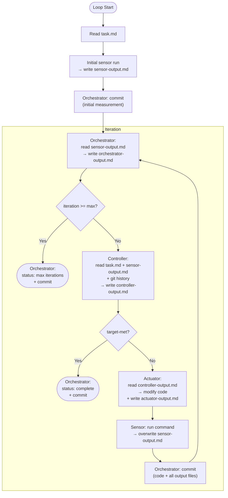
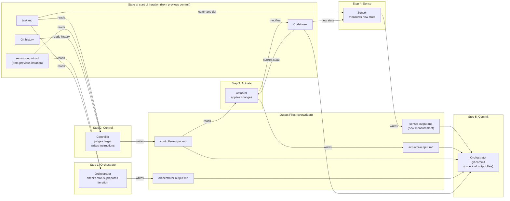

# AI Loops — Detailed Component Design

## Guiding Principle

Each component (box) in the loop is **independent**. We do not assume a shared agent context between them. Every component receives explicit **input artifacts** and produces explicit **output artifacts**. This forces us to think clearly about what information flows where.

**Artifacts are files** — specifically Markdown files with an optional YAML frontmatter for key metadata. The body is free-form content (logs, natural language, etc.). We do not impose rigid data structures: LLMs produce text, tools produce logs, and that's what flows through the system.

**Git is the timeline.** We don't duplicate history into per-iteration folders. Artifact files are overwritten each iteration and committed. To see a previous iteration's state, use `git log`, `git diff`, or `git show`. Each iteration produces at least one commit — that's the sampling clock.

**Every component writes a `{role}-output.md`.** This is the uniform contract: each box reads the output files of the boxes before it, does its work, and writes its own output file. The next box in the chain knows exactly which file to read.

---

## Concrete Scenario

To ground this design, we use a minimal example:

- **Language**: Java (compiled)
- **Task**: Write a function that computes the factorial of a number
- **Single metric**: Compilation (does it compile without errors?)
- **Sampling clock**: Git commits

This is the simplest possible loop: one metric, one sensor, one pass/fail signal.

---

## 1. Artifact Convention

All artifacts are **Markdown files** in a known location. Each has:

- A **well-known filename** following the pattern `{role}-output.md`
- An optional **YAML frontmatter** for the few truly essential metadata fields
- A **free-form body** for everything else (logs, instructions, notes)

File layout:

```
loop-run/
├── task.md                    # Task specification (static, written once)
├── sensor-output.md           # Latest sensor output (overwritten each iteration)
├── controller-output.md       # Latest controller instructions (overwritten each iteration)
├── actuator-output.md         # Latest actuator report (overwritten each iteration)
└── orchestrator-output.md     # Loop status / final result (overwritten each iteration)
```

The naming is the contract. Each component knows which `{role}-output.md` files to read (from previous steps) and which one to write (its own).

**History lives in git.** To see what the sensor reported last iteration: `git show HEAD~1:loop-run/sensor-output.md`. To see how the controller instructions evolved: `git log -p loop-run/controller-output.md`.

---

## 2. Components, Inputs, and Outputs

### 2.1 Task Specification (Static Input)

The task spec is the **setpoint**. Written once before the loop starts. Does not change.

**File**: `task.md`

```markdown
---
max-iterations: 10
sensors:
  compilation:
    command: "javac src/**/*.java"
    target: "no errors"
---

# Task

Write a Java method `factorial(int n)` that returns the factorial of n.
```

The frontmatter carries what's mechanically needed:
- **`max-iterations`**: when to give up
- **`sensors`**: a map of sensor definitions. Each one has a `command` to run and a `target` described in plain text. The target is for the controller — it reads it to understand what "done" means for this metric.

There are no `target-files` — the actuator discovers which files to create or modify as it works. The body is natural language that the controller and actuator will read as-is.

---

### 2.2 Sensor

**Role**: Observe the current state of the codebase. Produce a report. Change nothing.

| | |
|---|---|
| **Reads** | `task.md` (sensor command definition) |
| **Runs** | The command from `task.md` → `sensors.compilation.command` |
| **Writes** | `sensor-output.md` |

**Example** — `sensor-output.md` after an iteration with errors:

```markdown
---
sensor: compilation
---

# Sensor Output — Compilation

## Command

javac src/main/java/Factorial.java

## Output

src/main/java/Factorial.java:3: error: missing return type
    public factorial(int n) {
           ^
src/main/java/Factorial.java:8: error: reached end of file while parsing
}
^
2 errors
```

The sensor just runs the command and dumps the output. No judgment — that's the controller's job.

**Key properties**:
- Idempotent: same codebase state produces the same report
- Read-only: never modifies code
- Dumb: captures output, does not interpret it

---

### 2.3 Controller

**Role**: Read the sensor output, judge whether the target is met, and if not, produce instructions for the actuator. This is the "brain" of the loop.

| | |
|---|---|
| **Reads** | `task.md`, `sensor-output.md`, git history for previous states |
| **Writes** | `controller-output.md` |

To access history, the controller (or the orchestrator on its behalf) can use git:
- `git show HEAD~1:loop-run/sensor-output.md` — previous sensor output
- `git show HEAD~1:loop-run/controller-output.md` — previous instructions
- `git log --oneline` — iteration timeline

**Example — first pass** (code doesn't exist yet):

```markdown
---
target-met: false
---

# Controller Output

This is the first iteration. No Java files exist yet, so the compilation
sensor has nothing to compile.

## Instructions for actuator

Write a Java file `src/main/java/Factorial.java` containing a public class
with a static method `factorial(int n)` that returns the factorial of n.

Use a simple iterative approach with a for loop. Return type should be `long`
to handle larger values.
```

**Example — fixing errors**:

```markdown
---
target-met: false
---

# Controller Output

The previous iteration produced code that does not compile. There are 2 errors.

## Errors to fix

1. **Line 3**: Missing return type on the method declaration. Add `long` as return type.
2. **Line 8**: Unclosed brace — the class or method body is not properly closed.

## Context from history

This is the first fix attempt. The code was just created last iteration.
Likely minor syntax issues from the initial generation.
```

**Example — target met**:

```markdown
---
target-met: true
---

# Controller Output

The compilation sensor reports no errors. The target "no errors" is met.
No further action needed.
```

**Key properties**:
- Stateless: all context comes from reading artifact files and git history
- Responsible for the `target-met` judgment
- Output is natural language that the actuator can directly consume

---

### 2.4 Actuator

**Role**: Take controller instructions and apply code changes. This is the "hands" of the system.

| | |
|---|---|
| **Reads** | `controller-output.md`, the current codebase |
| **Does** | Modifies code files (does NOT commit — that's the orchestrator's job) |
| **Writes** | `actuator-output.md` |

**Example** — `actuator-output.md`:

```markdown
# Actuator Output

## What was done

Created `src/main/java/Factorial.java` with a `factorial(int n)` method
using an iterative approach with a for loop. Return type is `long`.

## Files changed

- `src/main/java/Factorial.java` (created)

## Notes

Chose iterative approach over recursive to avoid stack overflow for large inputs.
```

The actuator documents what it did in its own words. The code changes live in the working tree until the orchestrator commits at the end of the iteration. `actuator-output.md` is the actuator's own account of what it did.

**Key properties**:
- Receives only the controller's instructions — no direct access to sensor output
- Modifies code but does NOT commit
- Stateless: no memory from previous iterations

---

### 2.5 Orchestrator

**Role**: Drive the cycle. Wire the components together. Manage lifecycle. **Commit at the end of each iteration.**

The orchestrator is the only piece that "sees" the whole picture. It calls each component in order, and after the sensor has measured the new state, the orchestrator commits everything (code changes + all output files) as a single commit. This commit is the sampling clock tick.

| | |
|---|---|
| **Reads** | `task.md`, `controller-output.md` (for target-met), `actuator-output.md` |
| **Manages** | Iteration counting, calling each component in order, termination, **git commits** |
| **Writes** | `orchestrator-output.md` |

The orchestrator's role within one iteration:
1. Read `sensor-output.md` (from previous iteration) — prepare context
2. Call the controller → reads target-met from `controller-output.md`
3. If `target-met: true` → write final `orchestrator-output.md`, commit, stop
4. If `max-iterations` reached → write final `orchestrator-output.md`, commit, stop
5. Otherwise → call actuator → call sensor → write `orchestrator-output.md` → **commit** → next iteration

`orchestrator-output.md` is the **shared registry** of the loop. It is updated at the start and end of every iteration. All other components can read it if they need shared context (current iteration number, loop status, accumulated history), but only the orchestrator writes to it.

**Example — mid-loop** (after iteration 1, not done yet):

```markdown
---
iteration: 1
status: running
max-iterations: 10
---

# Orchestrator Output

## Current status

Loop is running. Iteration 1 completed. Target not yet met.

## History

- **Iteration 0**: Code created. Sensor reported compilation errors.
  Controller instructed to create the file. Actuator created Factorial.java.
- **Iteration 1**: Sensor reported 2 compilation errors. Controller
  instructed fixes. Actuator applied fixes.
```

**Example — loop complete**:

```markdown
---
iteration: 2
status: complete
---

# Orchestrator Output

## Result

The loop completed after 2 iterations. The target was met.

## History

- **Iteration 0**: Code created. Compilation failed (2 errors: missing return type, unclosed brace).
- **Iteration 1**: Errors fixed. Compilation succeeded.

## Final State

The file `src/main/java/Factorial.java` compiles cleanly.
```

Because this file is committed at each iteration, any component can also look at its git history to see how the loop has evolved over time.

---

## 3. The Chain: Who Reads Whose Output

The key insight is that **the sensor ends the iteration, not starts it**. The `sensor-output.md` from iteration N-1 is what the controller reads at the start of iteration N. Git tracks the history — the files on disk always represent the latest state.

The order within one iteration:

```
┌──────────────┐     ┌──────────────┐     ┌──────────┐     ┌─────────┐
│ Orchestrator │────→│  Controller  │────→│ Actuator │────→│ Sensor  │
│              │     │              │     │          │     │         │
│ reads:       │     │ reads:       │     │ reads:   │     │ reads:  │
│  task.md     │     │  task.md     │     │  ctrl-out│     │  task.md│
│  sensor-out  │     │  sensor-out  │     │  codebase│     │ (cmd)   │
│  (from N-1)  │     │  git history │     │          │     │ codebase│
│              │     │              │     │ writes:  │     │         │
│ writes:      │     │ writes:      │     │  code    │     │ writes: │
│  orch-output │     │  ctrl-output │     │  act-out │     │  sensor-│
│              │     │              │     │          │     │  output │
└──────────────┘     └──────────────┘     └──────────┘     └─────────┘
       ↑                                                        │
       └──────── orchestrator commits everything ───────────────┘
```

| Step | Component | Reads | Writes |
|---|---|---|---|
| 1 | **Orchestrator** | `task.md` + `sensor-output.md` (from previous iteration) | `orchestrator-output.md` |
| 2 | **Controller** | `task.md` + `sensor-output.md` + git history | `controller-output.md` |
| 3 | **Actuator** | `controller-output.md` + codebase | `actuator-output.md` + code changes (no commit) |
| 4 | **Sensor** | `task.md` (command def) + codebase (post-actuator) | `sensor-output.md` |
| 5 | **Orchestrator** | all output files | **git commit** (code + all output files) |

The orchestrator commits at the end — code changes, sensor output, and all other output files go into a single commit. This commit is the sampling clock tick and becomes the state that the next iteration starts from.

---

## 4. Sequential Flow — One Full Loop Execution

At startup, there is no previous `sensor-output.md`. The very first thing the loop does is run the sensor to establish the initial state (iteration 0 is just a measurement). Then the normal cycle begins.



---

## 5. Single Iteration — Artifact Flow

This shows what each component reads and writes within one iteration (after the initial sensor measurement):



---

## 6. Walkthrough — Factorial Example

### Initial measurement (before iteration 1)

| Step | What happens | Output file |
|---|---|---|
| **Sensor** | Runs `javac src/**/*.java` — no files exist. Captures error output. | `sensor-output.md`: compiler "file not found" logs |
| **Orchestrator** | Commits `sensor-output.md` as initial baseline. | Git commit (initial measurement) |

This establishes the baseline.

### Iteration 1

| Step | What happens | Output file |
|---|---|---|
| **Orchestrator** | Reads `sensor-output.md` (errors). First iteration, loop not done. | `orchestrator-output.md`: `status: running`, iteration 1 starting |
| **Controller** | Reads task.md (target: "no errors") + sensor output (errors). Target not met. Decides: create the file. | `controller-output.md`: `target-met: false`, instructions to create Factorial.java |
| **Actuator** | Reads controller instructions. Writes `Factorial.java`. | `actuator-output.md`: summary of what was created |
| **Sensor** | Runs `javac src/**/*.java` → 2 errors (missing return type, unclosed brace). | `sensor-output.md`: javac error output (overwrites) |
| **Orchestrator** | Commits everything (Factorial.java + all output files). | Git commit (end of iteration 1) |

### Iteration 2

| Step | What happens | Output file |
|---|---|---|
| **Orchestrator** | Reads `sensor-output.md` (2 errors). Iteration 2 < max 10 → continue. | `orchestrator-output.md`: `status: running` (overwrites) |
| **Controller** | Reads sensor output + git history. Still errors → target not met. Produces fix instructions. | `controller-output.md`: `target-met: false`, fix instructions (overwrites) |
| **Actuator** | Reads controller instructions. Fixes both issues. | `actuator-output.md`: summary of fixes (overwrites) |
| **Sensor** | Runs `javac src/**/*.java` → 0 errors. | `sensor-output.md`: clean compilation output (overwrites) |
| **Orchestrator** | Commits everything (fixed code + all output files). | Git commit (end of iteration 2) |

### Iteration 3

| Step | What happens | Output file |
|---|---|---|
| **Orchestrator** | Reads `sensor-output.md` (clean). | `orchestrator-output.md`: `status: running` (overwrites) |
| **Controller** | Reads sensor output. No errors → target "no errors" is met. | `controller-output.md`: `target-met: true` (overwrites) |
| **Orchestrator** | Reads `target-met: true` → loop ends. Writes final status. Commits. | `orchestrator-output.md`: `status: complete` (overwrites) + git commit |

Note: when the controller says `target-met: true`, the orchestrator skips actuation and sensor, and ends the loop.

---

## 7. Artifact Dependency Summary

| File | Written by | Read by |
|---|---|---|
| `task.md` | User (before loop) | Sensor, Controller, Orchestrator |
| `sensor-output.md` | Sensor | Controller |
| `controller-output.md` | Controller | Actuator, Orchestrator |
| `actuator-output.md` | Actuator | Orchestrator |
| `orchestrator-output.md` | Orchestrator | All components (shared registry: iteration number, status, history) |
| Codebase (working tree) | Actuator (modifies) | Sensor, Actuator |
| Git commits | Orchestrator (commits at end of iteration) | Controller (history) |

---

## 8. Independence Guarantees

Each component can be implemented and tested in isolation:

| Component | Needs | Does NOT need |
|---|---|---|
| **Sensor** | The codebase + a command from task.md | Task description, controller logic, history |
| **Controller** | task.md + sensor-output.md + git history | Access to codebase, ability to run tools |
| **Actuator** | controller-output.md + current codebase | Sensor output, target judgment, history |
| **Orchestrator** | task.md + controller-output.md + actuator-output.md | Implementation details of any component |

Swappable:
- Sensor: `javac` → `gcc` → `tsc` → any tool that produces output
- Controller: simple heuristic → PID-inspired → full LLM reasoning
- Actuator: Claude → GPT → human developer following the controller's instructions
