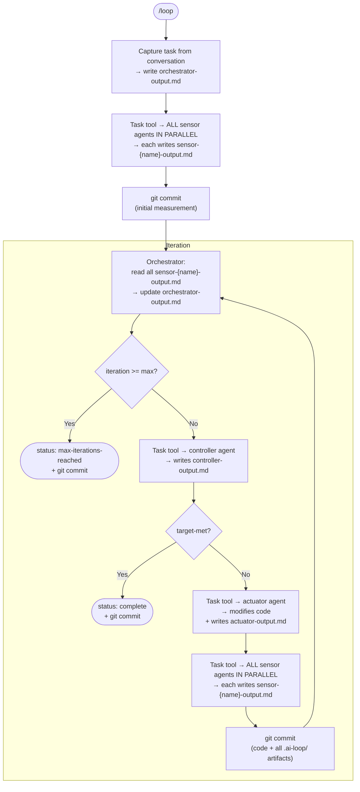
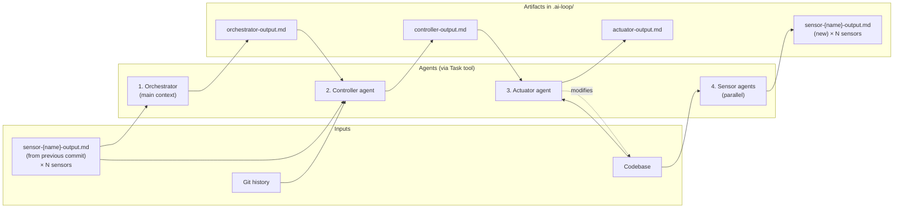

# AI Loops — Claude Code Plugin Implementation Design

## 1. Purpose & Scope

This document describes a **concrete implementation** of the [Loop Architecture](loop-architecture.md) as a **Claude Code plugin**. It maps each abstract agent and artifact to a specific Claude Code construct (skill, custom agent, file) and defines the contracts, tool restrictions, and iteration lifecycle in those terms.

The plugin is called **`ai-loops`**. It acts as a **scaffolding tool**: once installed, it helps set up a project with concrete, project-local agents via `/loop-init`. After setup, everything is explicit and local — no runtime discovery, no templates resolved on the fly. The plugin provides setup skills and templates; the project owns the agents.

For the abstract definitions of agents, artifacts, data flow, and guarantees, see [Loop Architecture](loop-architecture.md). This document does not repeat them — it specifies how they are realized.

---

## 2. Plugin Structure

```
ai-loops/                              # Plugin root (this repository)
├── .claude-plugin/
│   └── plugin.json                    # Plugin manifest (name: "ai-loops")
├── skills/
│   ├── loop/
│   │   └── SKILL.md                   # /loop — orchestrator (runs the loop)
│   ├── loop-init/
│   │   └── SKILL.md                   # /loop-init — initial project scaffolding
│   ├── loop-setup/
│   │   └── SKILL.md                   # /loop-setup — refresh config (regenerate controller after adding sensors)
│   └── loop-status/
│       └── SKILL.md                   # /loop-status — inspect current state
├── templates/                         # Templates used by setup skills
│   ├── sensor.md                      # Template for a sensor agent
│   ├── controller.md                  # Template for the controller agent
│   └── actuator.md                    # Template for the actuator agent
└── README.md
```

| Path | Role | Claude Code construct |
|---|---|---|
| `skills/loop/SKILL.md` | Orchestrator | Skill (`/loop`) |
| `skills/loop-init/SKILL.md` | Project setup | Skill (`/loop-init`) |
| `skills/loop-setup/SKILL.md` | Controller regeneration | Skill (`/loop-setup`) |
| `skills/loop-status/SKILL.md` | Status inspection | Skill (`/loop-status`) |
| `templates/sensor.md` | Sensor agent template | Used by `/loop-init` and manual setup |
| `templates/controller.md` | Controller agent template | Used by `/loop-setup` |
| `templates/actuator.md` | Actuator agent template | Used by `/loop-init` |

After setup, the **project** contains concrete agents and runtime artifacts:

```
.claude/agents/                        # Concrete agents (project-local)
├── loop-sensor-compilation.md         # Sensor: runs javac
├── loop-sensor-tests.md               # Sensor: runs mvn test
├── loop-controller.md                 # Controller: knows all sensors, targets, priorities
└── loop-actuator.md                   # Actuator: applies code changes

.ai-loop/                             # Runtime artifacts
├── sensor-compilation-output.md       # One output per sensor
├── sensor-tests-output.md
├── controller-output.md
├── actuator-output.md
└── orchestrator-output.md
```

---

## 3. Artifact Convention

All loop artifacts live in a hidden directory at the project root:

```
.ai-loop/
├── sensor-{name}-output.md    # One per sensor (overwritten each iteration)
├── controller-output.md       # Latest controller decision (overwritten each iteration)
├── actuator-output.md         # Latest actuator action report (overwritten each iteration)
└── orchestrator-output.md     # Loop state / registry (overwritten each iteration)
```

### 3.1 File Format

Each artifact is a **Markdown file** with an optional **YAML frontmatter** for essential metadata and a free-form body for content. This mirrors the architecture's artifact definitions:

| Architecture artifact | File | Frontmatter fields |
|---|---|---|
| Observation | `sensor-{name}-output.md` | `sensor` |
| Decision | `controller-output.md` | `target-met` |
| Action Report | `actuator-output.md` | *(none required)* |
| Loop State | `orchestrator-output.md` | `iteration`, `status`, `max-iterations` |

### 3.2 Git as Timeline

**Git is the timeline.** Artifact files are overwritten each iteration and committed. History is accessed via git:

- `git show HEAD~1:.ai-loop/sensor-compilation-output.md` — previous observation
- `git log -p .ai-loop/controller-output.md` — decision history
- `git log --oneline` — iteration timeline

Each iteration produces exactly one commit. This commit is the sampling clock tick and the timeline boundary defined in the architecture.

### 3.3 Task Input

There is no `task.md` configuration file. The task is described **conversationally** by the user when invoking `/loop`. The orchestrator captures the task description in `orchestrator-output.md` at loop start, making it available to all agents via the loop state artifact.

---

## 4. Component Implementation

### 4.1 Sensor Agents

**Architecture role:** Sensor — observe the current state, change nothing.

**Claude Code construct:** Concrete project-local agents in `.claude/agents/loop-sensor-{name}.md`. Each sensor is a separate agent file created by `/loop-init` or manually by the user.

Each sensor is **self-contained**: it knows its own command, what to measure, and how to format its output. There is no central configuration file that lists sensors — each sensor agent carries its own definition.

**Tool restrictions:**

| Allowed | Denied |
|---|---|
| `Bash` (run measurement commands), `Read`, `Glob` | `Edit`, `Write`, `NotebookEdit` |

The sensor is read-only. It can execute commands and read files but cannot modify anything.

**Behavior contract:**

1. Run the measurement command defined in its own agent instructions.
2. Extract the useful signal from command output (may summarize verbose output).
3. Write its output to `.ai-loop/sensor-{name}-output.md`.
4. Make no judgment about whether the target is met — that is the controller's job.

**Example sensor agent** (`.claude/agents/loop-sensor-compilation.md`):

```markdown
# Sensor: Compilation

You are a sensor agent for the ai-loop. Your job is to measure compilation status.

## Measurement

Run the following command:

    javac src/**/*.java

## Output

Write the result to `.ai-loop/sensor-compilation-output.md` with the following format:

- YAML frontmatter with `sensor: compilation`
- A "Command" section showing what was run
- An "Output" section with the command output (summarize if very verbose)

## Rules

- You are READ-ONLY. Do not modify any source files.
- Do not judge whether the output is good or bad. Just report what you see.
- Do not use Edit, Write (except for the output file), or NotebookEdit.
```

**Example output** (`.ai-loop/sensor-compilation-output.md`):

```markdown
---
sensor: compilation
---

# Sensor Output: compilation

## Command
javac src/main/java/Factorial.java

## Output
src/main/java/Factorial.java:3: error: missing return type
    public factorial(int n) {
           ^
2 errors
```

**Key properties:** Idempotent, read-only, stateless. Same codebase state produces the same report.

### 4.2 Controller Agent

**Architecture role:** Controller — judge the current state against the target, decide what to do next.

**Claude Code construct:** Concrete project-local agent in `.claude/agents/loop-controller.md`, generated by `/loop-setup` with explicit knowledge of all sensors.

The controller is **not** a generic agent that discovers sensors at runtime. It is regenerated by `/loop-setup` whenever the sensor set changes, and contains an explicit list of all sensors, their output files, target conditions, and priority ordering.

**Tool restrictions:**

| Allowed | Denied |
|---|---|
| `Read`, `Glob`, `Grep`, `Bash` (git commands only) | `Edit`, `Write`, `NotebookEdit` |

The controller can read all artifacts and access git history for trend analysis. It cannot modify code or artifacts other than its own output.

**Behavior contract:**

1. Read all sensor output files listed in its agent instructions.
2. Read `orchestrator-output.md` for the task description and iteration history.
3. Optionally read git history for previous observations and decisions (trend detection, stagnation avoidance).
4. For each sensor, compare the observation against the target condition defined in its own instructions.
5. Produce `controller-output.md` with:
   - `target-met: true` if all targets are satisfied, or `target-met: false` otherwise.
   - When target is not met: diagnosis of current errors and corrective instructions for the actuator.
   - Historical context when relevant (what was tried before, whether progress is being made).

**Decision protocol:**

- If **all** sensor targets are met → `target-met: true`. No instructions needed.
- If **any** sensor target is not met → `target-met: false`. Instructions must address all unmet targets.
- The controller is the **sole owner** of the `target-met` judgment.
- When multiple targets are unmet, the controller uses the priority ordering in its instructions to determine which to address first.

**Example controller agent** (`.claude/agents/loop-controller.md`, generated by `/loop-setup`):

```markdown
# Controller

You are the controller agent for the ai-loop. You judge the current state
against target conditions and produce corrective instructions.

## Sensors

The following sensors are active. Read each output file and compare against
its target condition.

### 1. compilation (priority: highest)
- **Output file:** `.ai-loop/sensor-compilation-output.md`
- **Target:** no compilation errors

### 2. tests (priority: normal)
- **Output file:** `.ai-loop/sensor-tests-output.md`
- **Target:** all tests pass

## Decision Protocol

1. Read all sensor output files listed above.
2. Read `.ai-loop/orchestrator-output.md` for the task description and history.
3. Compare each sensor's output against its target.
4. If ALL targets are met → set `target-met: true`.
5. If ANY target is not met → set `target-met: false` and provide instructions.
6. When multiple targets fail, address them in priority order.

## Output

Write your decision to `.ai-loop/controller-output.md`.

## Rules

- You are the SOLE OWNER of the target-met judgment.
- Do not modify any source files. Read only.
- Use git history to detect trends and avoid repeating failed strategies.
```

**Output format** (`controller-output.md`):

```markdown
---
target-met: false
---

# Controller Output

The compilation sensor reports 2 errors. Target "no errors" is not met.

## Instructions for Actuator

1. **Line 3**: Add `long` as the return type for the `factorial` method.
2. **Line 8**: Close the method body with a `}`.

## Context

First fix attempt. Code was just created last iteration.
```

**Key properties:** Stateless (all context from artifacts and git), sole target-met authority, generated with explicit sensor knowledge.

### 4.3 Actuator Agent

**Architecture role:** Actuator — apply corrective changes to the codebase.

**Claude Code construct:** Concrete project-local agent in `.claude/agents/loop-actuator.md`.

**Tool restrictions:**

| Allowed | Denied |
|---|---|
| `Read`, `Edit`, `Write`, `Glob`, `Grep`, `Bash` | *(no restrictions — full code modification)* |

The actuator has full access to code modification tools. It is the only agent that changes the codebase.

**Behavior contract:**

1. Read `controller-output.md` for instructions.
2. Read the current codebase as needed to understand what to change.
3. Apply the changes described by the controller.
4. Write `actuator-output.md` summarizing what was done.
5. Do **NOT** commit — the orchestrator handles commits.
6. Do **NOT** read sensor output files directly — the controller has already digested the observation into instructions.

**Output format** (`actuator-output.md`):

```markdown
# Actuator Output

## What Was Done

Fixed two compilation errors in `src/main/java/Factorial.java`:
- Added `long` return type to the `factorial` method declaration.
- Added missing closing brace for the class body.

## Files Changed

- `src/main/java/Factorial.java` (modified)
```

**Key properties:** Stateless, follows controller instructions, does not judge target status.

### 4.4 Orchestrator Skill (`/loop`)

**Architecture role:** Orchestrator — drive the cycle, wire agents together, manage lifecycle and state.

**Claude Code construct:** Skill defined in `skills/loop/SKILL.md`. When the user types `/loop`, Claude receives the orchestrator instructions and drives the iteration cycle.

**Why a skill, not an agent:** The orchestrator must remain in the **main conversation context** where it can:

- Spawn sensor, controller, and actuator agents via the `Task` tool.
- Manage git commits directly.
- Interact with the user (report progress, ask for confirmation on termination).

An agent runs in a subprocess and cannot do these things.

**Behavior contract:**

1. Capture the task description from the conversation into `orchestrator-output.md`.
2. Read sensor agent files from `.claude/agents/loop-sensor-*.md` to know which sensors exist.
3. **Initial measurement**: Spawn all sensor agents **in parallel** via parallel `Task` tool calls. Commit the results.
4. **Iteration loop**:
   a. Read all `sensor-{name}-output.md` files. Update `orchestrator-output.md`.
   b. Check iteration count against `max-iterations`. If reached → finalize with status `max-iterations-reached`, commit, stop.
   c. Spawn the controller agent. Read `controller-output.md`.
   d. If `target-met: true` → finalize with status `complete`, commit, stop.
   e. Spawn the actuator agent.
   f. Spawn all sensor agents **in parallel** (measures the new state).
   g. Commit all changes (code + all `.ai-loop/` artifacts) as a single commit.
   h. Next iteration.

**Agent spawning:** The orchestrator uses the `Task` tool to spawn each agent. Sensors are spawned in parallel; controller and actuator are spawned sequentially:

```
# Parallel sensor spawning
Task(subagent_type="loop-sensor-compilation", prompt="Run your measurement ...")
Task(subagent_type="loop-sensor-tests", prompt="Run your measurement ...")
# (spawned simultaneously)

# Sequential
Task(subagent_type="loop-controller", prompt="Read sensor outputs and produce decision ...")
Task(subagent_type="loop-actuator", prompt="Read controller-output.md and apply changes ...")
```

**Git commit management:** At the end of each iteration (and after the initial measurement), the orchestrator commits:

- All files in `.ai-loop/` (artifact updates)
- All codebase changes made by the actuator

The commit message follows a convention: `ai-loop: iteration {N} — {brief summary}`.

**Loop State output** (`orchestrator-output.md`):

```markdown
---
iteration: 2
status: running
max-iterations: 10
---

# Loop State

## Task

Implement a `factorial(int n)` method in Java that returns the factorial of n.
Use an iterative approach. Handle edge cases (n=0, negative input).

## Current Status

Iteration 2 completed. Target not yet met.

## History

- **Iteration 0**: Initial measurement. Compilation failed (no source files).
- **Iteration 1**: Code created. Compilation failed (2 errors).
- **Iteration 2**: Errors fixed. Compilation succeeded. Tests not yet passing.
```

---

## 5. Skills Reference

### 5.1 `/loop-init` — Initial Project Setup

**Purpose:** First-time project scaffolding. Creates concrete agent files and the `.ai-loop/` directory.

**Behavior:**

1. Interactive: asks the user what sensors to create (compilation, tests, linting, etc.).
2. Creates `.claude/agents/loop-sensor-{name}.md` for each sensor, using `templates/sensor.md` as a base and filling in the sensor-specific command and description.
3. Creates `.claude/agents/loop-actuator.md` from `templates/actuator.md`.
4. Runs `/loop-setup` logic to generate `.claude/agents/loop-controller.md` with knowledge of the initial sensors.
5. Creates the `.ai-loop/` directory.
6. Suggests `.gitignore` patterns or an `ai-loop` branch strategy.

### 5.2 `/loop-setup` — Refresh Configuration

**Purpose:** Regenerate the controller after sensor changes. Idempotent — safe to run at any time.

**Behavior:**

1. Glob for `.claude/agents/loop-sensor-*.md`.
2. Read each sensor agent to extract: name, what it measures, command, expected output shape.
3. Regenerate `.claude/agents/loop-controller.md` from `templates/controller.md` with:
   - List of all sensors and their output files
   - Target condition per sensor
   - Priority ordering
   - Decision protocol (how to combine multiple sensor results into a single target-met judgment)
4. Optionally update the actuator if needed.

This means the controller is always in sync with the sensors. Add a sensor → run `/loop-setup` → controller is updated.

### 5.3 `/loop` — Run the Loop

**Purpose:** Start or resume the AI loop in the current project.

**Preconditions:** Concrete agents must exist in `.claude/agents/` (created by `/loop-init` or manually).

**Behavior:**

1. Validates that sensor agents exist in `.claude/agents/loop-sensor-*.md`.
2. Validates that `loop-controller.md` and `loop-actuator.md` exist.
3. If `.ai-loop/orchestrator-output.md` exists with `status: running`, resumes from the current iteration.
4. Otherwise, captures the task from conversation, starts from iteration 0 (initial measurement).
5. Runs the iteration cycle described in Section 4.4 until termination.
6. Reports the final result to the user.

### 5.4 `/loop-status` — Inspect Current State

**Purpose:** Show the current loop state without running an iteration.

**Behavior:**

1. Reads `.ai-loop/orchestrator-output.md` and displays the current iteration, status, and history.
2. Reads the latest sensor output files and `controller-output.md` to summarize the current situation.
3. Shows git log for the `.ai-loop/` directory to display the iteration timeline.

---

## 6. Project Customization

Sensors are always project-specific. The controller is generated but editable. `/loop-setup` is the sync mechanism.

### 6.1 Adding Sensors

To add a new sensor:

1. Create `.claude/agents/loop-sensor-{name}.md` (manually or by copying an existing sensor and modifying it).
2. Define the measurement command and output format.
3. Run `/loop-setup` to regenerate the controller with knowledge of the new sensor.

The sensor template (`templates/sensor.md`) provides the structure. The user fills in the specifics.

### 6.2 Editing the Controller

`/loop-setup` generates the controller, but the generated file is a regular agent file that can be edited. Common customizations:

- **Priority ordering**: Change which sensors are addressed first when multiple targets are unmet.
- **Decision strategy**: Adjust how sensor results are combined (e.g., address compilation before tests, or require all targets to be met simultaneously).
- **Stagnation detection**: Add instructions for recognizing when the loop is stuck and should try a different approach.

After manual edits, running `/loop-setup` again will **overwrite** the controller. If custom logic is needed permanently, either avoid re-running `/loop-setup` or add the customization to the template.

### 6.3 Editing the Actuator

The actuator is created once by `/loop-init` and not regenerated by `/loop-setup`. Projects can freely customize it:

- **Code style enforcement**: Add instructions to run a formatter after making changes.
- **Scope constraints**: Limit which files or directories the actuator may modify.
- **Testing requirements**: Instruct the actuator to write tests alongside fixes.

### 6.4 Controller Strategies

The controller agent's behavior can be further customized by editing its decision protocol. For example:

```markdown
## Decision Protocol

When multiple errors exist, prioritize in this order:
1. Compilation errors
2. Type errors
3. Test failures
4. Lint warnings

If the same error persists for 3 iterations, instruct the actuator to try
a fundamentally different approach rather than incremental fixes.
```

For deeper customization (e.g., PID-like error tracking, adaptive strategies), edit `loop-controller.md` directly.

---

## 7. Iteration Lifecycle

This section maps the abstract lifecycle from the [architecture](loop-architecture.md) to concrete Claude Code operations.

### 7.1 Initial Measurement (Iteration 0)

```
User types /loop, describes the task
  → Skill activates: orchestrator instructions loaded into main context
  → Orchestrator captures task description in orchestrator-output.md
  → Orchestrator spawns ALL sensor agents in PARALLEL via Task tool
    → sensor-compilation runs javac, writes sensor-compilation-output.md
    → sensor-tests runs mvn test, writes sensor-tests-output.md
    → (all sensors run simultaneously)
  → Orchestrator commits .ai-loop/ ("ai-loop: iteration 0 — initial measurement")
```

### 7.2 Normal Iteration

```
Orchestrator reads all sensor-{name}-output.md files
  → Updates orchestrator-output.md
  → Checks iteration < max-iterations
  → Spawns controller agent via Task tool
    → Controller reads sensor outputs + orchestrator-output.md + git history
    → Controller writes controller-output.md
  → Orchestrator reads controller-output.md
  → If target-met: true → finalize, commit, stop
  → Spawns actuator agent via Task tool
    → Actuator reads controller-output.md + codebase
    → Actuator modifies code, writes actuator-output.md
  → Spawns ALL sensor agents in PARALLEL via Task tool
    → Each sensor runs its command, writes its output file
    → (all sensors run simultaneously)
  → Orchestrator commits all changes
    ("ai-loop: iteration N — {summary}")
```

### 7.3 Termination

```
target-met: true
  → Orchestrator writes orchestrator-output.md (status: complete)
  → Commits final state
  → Reports success to user

iteration >= max-iterations
  → Orchestrator writes orchestrator-output.md (status: max-iterations-reached)
  → Commits final state
  → Reports failure to user with summary of progress
```

### 7.4 Flow Diagram



---

## 8. Dependency Graph

Within a single iteration, sensors run in parallel, then controller, then actuator, then sensors again in parallel.



| Agent | Claude Code construct | Spawned by | Inputs | Output |
|---|---|---|---|---|
| **Orchestrator** | `/loop` skill (main context) | User | `sensor-{name}-output.md` × N | `orchestrator-output.md`, git commits |
| **Controller** | `.claude/agents/loop-controller.md` (Task tool) | Orchestrator | `sensor-{name}-output.md` × N, `orchestrator-output.md`, git history | `controller-output.md` |
| **Actuator** | `.claude/agents/loop-actuator.md` (Task tool) | Orchestrator | `controller-output.md`, codebase | `actuator-output.md`, code changes |
| **Sensors** | `.claude/agents/loop-sensor-{name}.md` (Task tool, parallel) | Orchestrator | codebase | `sensor-{name}-output.md` |
